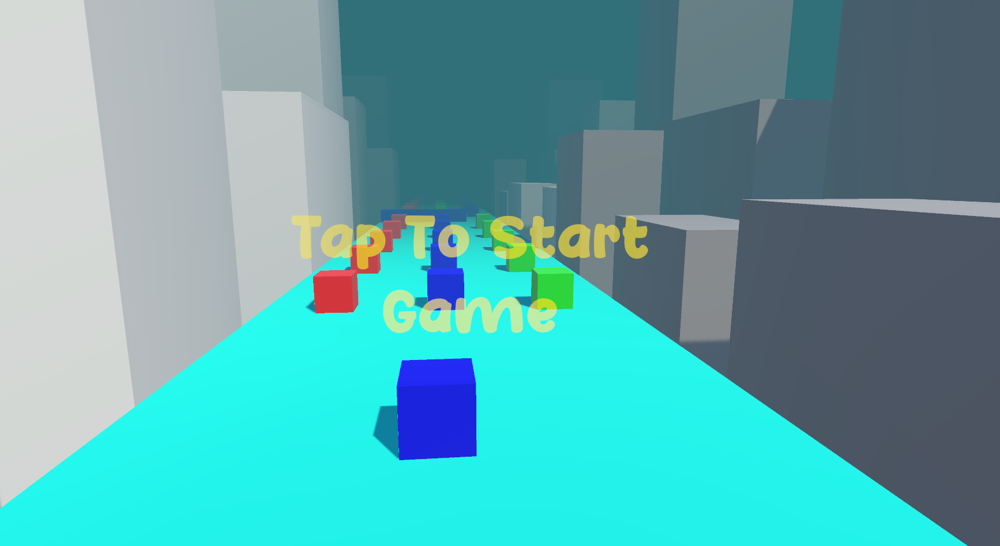

# 🎨 Portfolio

Welcome to my personal portfolio repository! This contains a showcase of my front-end projects, designs, and experiments with HTML, CSS, and JavaScript.

---

## 🗂️ Project Included

### 🚀 CubeRunner.zip
A mini web game or project compressed into a ZIP file. Download and unzip it to explore the source code and try it out locally.

---

## 📁 Files in This Repository

- `CubeRunner.zip` – A zipped game or project.
- `port.html` – Main HTML file for the portfolio.
- `port.css` – Stylesheet for the portfolio layout.
- Image assets:
  - `game.png`, `linkedin.png`, `github.png`, etc.
- `resume.pdf` – My resume in PDF format.

---

## 📸 Preview

Here are a few previews from the portfolio:

> 💡 *Note: If images are not loading, make sure they are pushed to the repository.*

---
